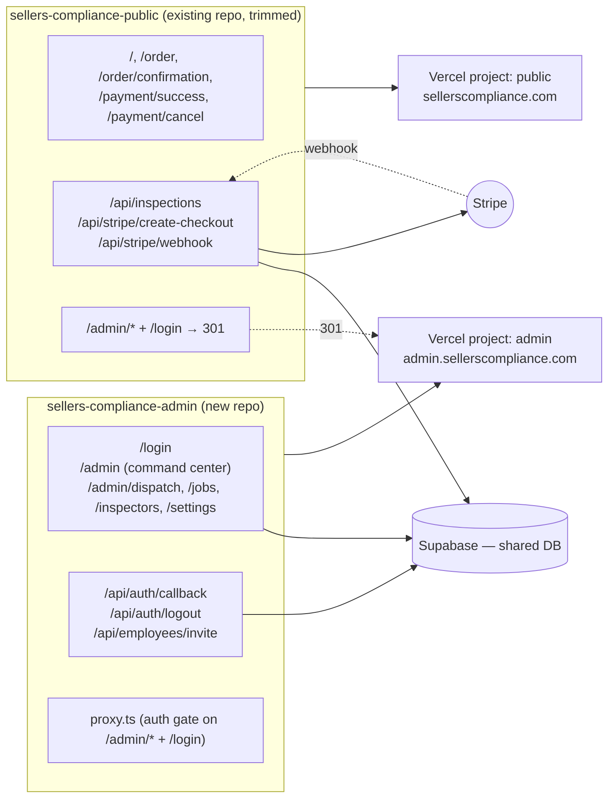

# Split Seller's Compliance into two repos / two Vercel projects

## Context
Today everything lives in one Next.js app (`sellers-compliance`, deployed to a single Vercel project at sellerscompliance.com). The public marketing site (`/`, `/order`, `/payment/*`) and the staff admin portal (`/admin/*`, `/login`) share one build, one deployment pipeline, and one git history. Any admin-side change risks breaking the live order-taking surface.

The goal is to physically separate the two so admin work has zero blast radius on the public site. Approach: duplicate a small shared core (Supabase clients, types, design tokens, a couple of utilities, shadcn UI primitives) into both repos rather than extract a shared package — the surface is small and the project is solo, so the maintenance cost of duplication is lower than the cost of a workspace/package.

Decisions already locked in (from clarifying questions):
- Admin subdomain: **admin.sellerscompliance.com**
- Old admin URLs on the public site: **301 redirect** (configured in `next.config.ts` of the public repo)
- Stripe webhook: **stays on sellerscompliance.com** (no Stripe dashboard change, no risk of dropped events)

## Target shape



The two deployments share Supabase and Stripe accounts. The admin repo never builds public code; the public repo never builds admin code. A broken admin build cannot affect the public site.

---

## File inventory

Source paths are relative to the current repo root.

### Goes to PUBLIC repo only (delete from admin)
- `src/app/page.tsx` — landing
- `src/app/order/page.tsx`
- `src/app/order/confirmation/page.tsx`
- `src/app/payment/success/page.tsx`
- `src/app/payment/cancel/page.tsx`
- `src/app/api/inspections/route.ts`
- `src/app/api/stripe/create-checkout/route.ts`
- `src/app/api/stripe/webhook/route.ts`
- `src/components/public/PublicHeader.tsx`
- `src/lib/utils/geocoding.ts` (only `/api/inspections` uses it)
- `src/lib/email/order-notification-template.ts`

### Goes to ADMIN repo only (delete from public)
- `src/app/admin/**` (entire tree: `layout.tsx`, `page.tsx`, `dispatch/`, `inspectors/`, `jobs/`, `settings/`)
- `src/app/login/page.tsx`
- `src/app/api/auth/callback/route.ts`
- `src/app/api/auth/logout/route.ts`
- `src/app/api/employees/invite/route.ts`
- `src/components/admin/**`
- `src/hooks/use-schedule-sync.ts`
- `src/lib/auth.ts`
- `src/lib/actions/**`
- `src/lib/queries/**`
- `src/lib/email/invite-template.ts`
- `src/lib/utils/formatting.ts` (only admin command-center cards use it)
- `src/services/**`
- `src/proxy.ts` — Next 16 middleware; only needs to exist where `/admin` and `/login` exist
- `supabase/schema.sql` — admin owns operational schema; public regenerates `database.ts` via `supabase gen types typescript`

### Duplicated in BOTH repos (small shared surface)
- `src/app/layout.tsx` (root layout — fonts, metadata)
- `src/app/globals.css`
- `src/styles/sc-bold-tokens.css`
- `src/styles/sc-bold-components.css`
- `src/lib/supabase/client.ts`
- `src/lib/supabase/server.ts`
- `src/lib/utils.ts` (the `cn` helper)
- `src/lib/stripe.ts` (public uses it for checkout + webhook; admin uses it for payment-link creation in `lib/actions/payment-actions.ts`)
- `src/lib/utils/pricing.ts` (public webhook recomputes invoice totals; admin command-center + payment actions use the same functions)
- `src/types/database.ts` — duplicate, then keep in sync via `supabase gen types typescript --project-id <id> > src/types/database.ts` run in each repo when the schema changes
- `src/components/ui/**` (shadcn primitives — `button`, `card`, `checkbox`, `dialog`, `dropdown-menu`, `input`, `label`, `select`, `textarea`, `avatar`, `address-autocomplete`). Public uses a subset (input, label, textarea, address-autocomplete) but the surface is small and self-contained, so duplicate the whole folder rather than prune.
- `public/**` (favicons, logos, hero image — admin uses the logo, public uses everything)
- `package.json`, `tsconfig.json`, `next.config.ts`, `eslint.config.mjs`, `postcss.config.mjs`, `.gitignore`
- `.env.example` — copy then trim per repo (see env section)

### Where duplication is the wrong fit (call-outs)
- **`supabase/schema.sql`**: do NOT duplicate — designate the admin repo as the schema owner. Public consumes the schema via generated types only.
- **`src/types/database.ts`**: technically duplicated, but the canonical source is the live Supabase project. Treat both copies as generated artifacts; never hand-edit either, always regenerate.
- Everything else in the shared list is small, stable, and rarely changes — duplication is fine.

### Pre-existing bugs surfaced during research (NOT in scope, listed so you can decide)
- ~~`src/app/login/page.tsx:29` redirects to `/admin/dashboard` (does not exist; real route is `/admin`).~~ **Fixed pre-split in commit `a445aeb` — now redirects to `/admin/dispatch` to match `src/proxy.ts:80`.**
- ~~`src/app/api/auth/callback/route.ts:7` defaults `next` to `/admin/dashboard` (same).~~ **Fixed pre-split in commit `a445aeb` — now defaults to `/admin/dispatch`.**
- `src/components/admin/command/CommandMetricsRow.tsx:78,87,97,107` — links to `/admin/dashboard?...` (broken).
- `src/app/api/employees/invite/route.ts:97` — generates `${siteUrl}/auth/setup-account?...` but no `/auth/setup-account` route exists.

The first two bugs are already fixed in the monolith and carry forward automatically when the admin repo is cloned in Step 1. Step 5 below is now a verification step, not a code change. The remaining two bugs are still out of scope for the split.

---

## Execution order

Each step is a checkpoint. If you stop after any step ≤ step 8, production is unchanged from today and admin still works at sellerscompliance.com/admin.

### Step 1 — Create the new admin repo (production untouched)
On your machine, in the parent dir of the current repo:
```bash
git clone <existing-repo-url> sellers-compliance-admin
cd sellers-compliance-admin
git remote remove origin
# Create new empty GitHub repo "sellers-compliance-admin" via gh or web UI, then:
git remote add origin git@github.com:<you>/sellers-compliance-admin.git
git push -u origin main
```
**Checkpoint:** New repo on GitHub with full history, identical code. Production unchanged.
**Rollback:** Delete the GitHub repo.

### Step 2 — Spin up the admin Vercel project
- Create a new Vercel project, import `sellers-compliance-admin`.
- Framework: Next.js (auto-detected).
- Build/install settings: defaults.
- Env vars (Production + Preview + Development) — see env table below.
- Deploy. You'll get `sellers-compliance-admin-<hash>.vercel.app`.

**Checkpoint:** Two deployments hit the same Supabase. Old prod still serves everything. New deployment serves the same app at a `*.vercel.app` URL.
**Rollback:** Pause/delete the new Vercel project.

### Step 2.5 — Mirror observability on the admin project
Before spending time in the new project, make sure the monitoring you rely on is actually running there.

1. Audit the existing `sellers-compliance` Vercel project:
   - Settings → **Analytics**, **Speed Insights**, **Log Drains**, **Integrations** — note which are enabled.
   - `package.json` — grep for `@sentry/nextjs`, `@vercel/analytics`, `@vercel/speed-insights`, `@highlight-run`, `posthog-js`, `@datadog/*`, etc.
   - `src/app/layout.tsx` and `src/instrumentation.ts` (if present) — note any `<Analytics />`, `<SpeedInsights />`, or Sentry init.
   - Env vars beginning with `SENTRY_`, `NEXT_PUBLIC_SENTRY_`, `DATADOG_`, `NEW_RELIC_`, `POSTHOG_`, `LOGTAIL_`.

2. For each enabled service, replicate on the admin project:
   - Same integration installed via Vercel UI (Sentry, Datadog, etc.).
   - Same env vars set in Production + Preview + Development.
   - Same code-level init (keep `<Analytics />` / `<SpeedInsights />` in the duplicated `src/app/layout.tsx`).

3. After the first admin deploy, confirm events flow: trigger an error on the admin preview URL and verify it shows up in Sentry / log drain / dashboard for the **admin** project specifically (not cross-contaminating the public project).

**Checkpoint:** Admin project has the same observability posture as the current monolith. If something breaks post-migration, you'll see it.
**Rollback:** Uninstall integrations / remove env vars. Non-destructive.

### Step 3 — Non-destructive smoke test on the vercel.app URL
**Read-only checks only.** No job creation, no schedule drags, no invite sends, no payment-link creation. Save mutation paths for Step 8 after the subdomain is live.

- Hit `https://<vercel-url>/login`, sign in with your existing user.
  - Session cookie will be scoped to `*.vercel.app` — this is a fresh cookie jar, existing `sellerscompliance.com` session does not carry over. Expected.
- Confirm these pages render with real data and no console errors:
  - `/admin` — metrics row, alerts, cards populate
  - `/admin/dispatch` — timeline renders with today's inspectors and jobs
  - `/admin/jobs` — list populates
  - `/admin/inspectors` — roster populates
  - `/admin/settings` — employee list populates
- Open DevTools Network tab: confirm Supabase RPC/REST calls return 200, not 401/403 (catches env var mistakes).
- Check server logs in Vercel dashboard for the deployment — no 5xx, no crashed functions.
- **Do not** click "Send invite", "Create payment link", "Save job", or drag anything. Those are Step 8.

**Checkpoint:** Admin reads correctly on the new deployment. No writes attempted. Still no DNS or customer-visible change.

### Step 4 — Strip public code from the admin repo
In `sellers-compliance-admin` on a new branch `chore/strip-public`:
```bash
git rm src/app/page.tsx
git rm -r src/app/order src/app/payment
git rm -r src/app/api/inspections src/app/api/stripe
git rm -r src/components/public
git rm src/lib/email/order-notification-template.ts
git rm src/lib/utils/geocoding.ts
```
Replace `src/app/page.tsx` with a tiny redirect so `/` on admin subdomain doesn't 404:
```tsx
import { redirect } from 'next/navigation'
export default function Root() { redirect('/admin') }
```
Trim `.env.example` to admin-only vars (see env table). Commit, push, merge to main, let Vercel deploy.

**Checkpoint:** Admin Vercel deploys successfully without any public code. Re-run the read-only smoke tests from step 3 at the vercel.app URL.
**Rollback:** `git revert` the merge commit, redeploy.

### Step 5 — Verify the admin login redirect (fix already applied pre-split)
The `/admin/dashboard` → `/admin/dispatch` redirect bug was fixed in the monolith before the split (commit `a445aeb`). The clone in Step 1 carries the fix forward automatically — **no code change needed here**. Just confirm both files still show `/admin/dispatch` as the destination:

- `src/app/login/page.tsx:29`: `window.location.assign('/admin/dispatch')`
- `src/app/api/auth/callback/route.ts:7`: `searchParams.get('next') ?? '/admin/dispatch'`

Quick grep to confirm:
```bash
cd sellers-compliance-admin
grep -n "admin/dashboard" src/app/login/page.tsx src/app/api/auth/callback/route.ts
# Expect: no output (zero matches). If anything comes back, something got lost in the clone.
grep -n "admin/dispatch" src/app/login/page.tsx src/app/api/auth/callback/route.ts
# Expect: one match per file.
```

Optional local test:
```bash
cp .env.example .env.local  # fill in real values
npm install
npm run dev
# visit http://localhost:3000/login, sign in, confirm landing on /admin/dispatch
```

If the greps look right (and optionally the local sign-in lands on `/admin/dispatch`), move on. No commit in this step.

### Step 6 — Attach the admin subdomain
In Vercel admin project → Settings → Domains:
- Add `admin.sellerscompliance.com`.
- Vercel will display a target like `cname.vercel-dns.com` (or an A record).

In your DNS provider:
- Add a CNAME: `admin` → `cname.vercel-dns.com.` (TTL 300).
- Wait for Vercel to verify + provision SSL (usually < 5 min).

**Checkpoint:** `https://admin.sellerscompliance.com/login` works. `https://sellerscompliance.com/admin/...` ALSO still works (public repo unchanged). Two valid paths to admin during this overlap window — that's intentional and safe.
**Rollback:** Remove the CNAME record; remove the domain in Vercel. No effect on public.

> **Session cookie note (read this once).** Supabase auth cookies are scoped to the exact hostname they were issued on. Your existing session on `sellerscompliance.com` will **not** be sent to `admin.sellerscompliance.com` — the browser treats them as separate origins. Practical impact:
> - First visit to `admin.sellerscompliance.com/login`, you (and every other admin user) will log in once on the new subdomain. One-time only; the admin cookie then persists on that subdomain.
> - The existing `sellerscompliance.com/admin` session remains valid throughout the overlap window (Steps 6–9). No force-logout.
> - Step 7 (Supabase Site URL change) does **not** invalidate existing sessions — it only changes the default link target in auth emails going forward.
> - After Step 9 strips admin from the public repo, the `sellerscompliance.com` admin cookie becomes useless (no admin routes left to send it to). No action required; it expires naturally.

### Step 7 — Update Supabase Auth allowed redirect URLs
Supabase Dashboard → Authentication → URL Configuration:
- Add to "Redirect URLs": `https://admin.sellerscompliance.com/api/auth/callback`, `https://admin.sellerscompliance.com/**`
- Keep the existing `https://sellerscompliance.com/**` entries for now (removed in step 11).
- Site URL: change to `https://admin.sellerscompliance.com` (this affects only Supabase-generated email links going forward).

Test the magic-link / password-reset flow if you use either.

### Step 8 — End-to-end (mutation) test on the real subdomain
This is the first step where you intentionally write to production data. Do it on `admin.sellerscompliance.com`, not the vercel.app URL, so you're exercising the actual domain + cookie path customers/admins will use.

- Log in at `https://admin.sellerscompliance.com/login`. Confirm landing on `/admin/dispatch`.
- Walk every admin page.
- Happy-path mutations (clean up each one when done):
  - **Create a test job** in `/admin/jobs/new` with a clearly-marked test address (e.g., "TEST — DELETE ME"). Confirm it appears in the list and on `/admin/dispatch`.
  - **Drag the test job** on `/admin/dispatch` to a different inspector/time slot. Refresh — confirm the change persisted in Supabase.
  - **Edit + delete** the test job.
  - **Create a test inspector** in `/admin/inspectors`, edit, then delete.
  - **Send an invite** from `/admin/settings` to an email you own (e.g., `manderso90+inviteTEST@gmail.com`). Confirm the Resend email arrives. Revoke/delete the pending invite after.
- **Payment-link test** (Stripe is in live mode — choose one):
  - **Option A (recommended):** Create a payment link from a real but small-dollar test job (e.g., `$1.00`). Pay it with your own card. Confirm the webhook (which still points at the public repo) records the payment and flips `payment_status` to `paid`. Then refund the $1 via the Stripe Dashboard (Payments → the charge → Refund). This exercises the full admin→Stripe→webhook→DB loop.
  - **Option B (if you have Stripe test keys ready):** Temporarily set `STRIPE_SECRET_KEY` in the admin Vercel project to your Stripe test-mode key, redeploy, create a payment link, pay with `4242 4242 4242 4242`, revert the env var to the live key. Skips the refund step but requires two redeploys.
  - Option A is simpler and mirrors production exactly. Use A unless you already have test keys wired up.
- Test logout — confirm session cookie is cleared and `/admin` bounces to `/login`.

**Checkpoint:** Admin is fully operational on its own subdomain, including writes and payments. Public is still serving everything from the old repo unchanged.

### Step 9a — Prepare the public-repo strip on a preview deployment
On the existing repo (the production one), branch `chore/extract-admin`:
```bash
git rm -r src/app/admin src/app/login
git rm -r src/app/api/auth src/app/api/employees
git rm -r src/components/admin
git rm src/hooks/use-schedule-sync.ts
git rm src/lib/auth.ts
git rm -r src/lib/actions src/lib/queries
git rm src/lib/email/invite-template.ts
git rm src/lib/utils/formatting.ts
git rm -r src/services
git rm src/proxy.ts
git rm supabase/schema.sql
```
Trim `.env.example` to public-only vars. Add redirects to `next.config.ts`:
```ts
import type { NextConfig } from 'next'
const nextConfig: NextConfig = {
  async redirects() {
    return [
      { source: '/admin', destination: 'https://admin.sellerscompliance.com/admin', permanent: true },
      { source: '/admin/:path*', destination: 'https://admin.sellerscompliance.com/admin/:path*', permanent: true },
      { source: '/login', destination: 'https://admin.sellerscompliance.com/login', permanent: true },
    ]
  },
}
export default nextConfig
```

Before merging to main, add the Stripe webhook protection comment (also applies going forward). In `src/app/api/stripe/webhook/route.ts`, at the top of the file (above imports or as the first line after them):
```ts
// DO NOT REMOVE — Stripe webhook endpoint.
// Production Stripe dashboard delivers live events to https://sellerscompliance.com/api/stripe/webhook.
// Renaming, moving, or deleting this route will drop live payment events.
// If you ever need to relocate it, update the webhook URL in the Stripe dashboard FIRST.
```

Run `npm run build` locally to confirm nothing in the remaining public code imports a deleted file. Commit, push the branch, open a PR — **do not merge yet**. Vercel will build a preview deployment for the PR.

Verify the redirects against the preview URL:
```bash
# Grab the preview URL from the PR (e.g., sellers-compliance-git-chore-extract-admin-<you>.vercel.app)
PREVIEW=https://<preview-url>

curl -sI "$PREVIEW/admin"         | head -n 5
# Expect: HTTP/2 301
#         location: https://admin.sellerscompliance.com/admin

curl -sI "$PREVIEW/admin/jobs"    | head -n 5
# Expect: HTTP/2 301
#         location: https://admin.sellerscompliance.com/admin/jobs

curl -sI "$PREVIEW/login"         | head -n 5
# Expect: HTTP/2 301
#         location: https://admin.sellerscompliance.com/login
```
Also hit the preview URL in a browser and confirm `/`, `/order`, `/payment/success`, `/payment/cancel` render.

**Checkpoint:** PR is open, preview build is green, all three redirects return 301 with the correct `Location` header from the preview URL. Main is still untouched.
**Rollback:** Close the PR. Zero impact.

### Step 9b — Merge to main and verify on production
Merge the PR. Let Vercel deploy to production.

Immediately after deploy, re-run the same curl checks against production:
```bash
curl -sI https://sellerscompliance.com/admin        | head -n 5
curl -sI https://sellerscompliance.com/admin/jobs   | head -n 5
curl -sI https://sellerscompliance.com/login        | head -n 5
```
All three must return `301` with `location: https://admin.sellerscompliance.com/...`.

**Checkpoint:** Public site serves `/`, `/order`, `/payment/*`, and the three `/api/*` routes. `/admin/*` and `/login` 301 to admin subdomain. Webhook URL unchanged → Stripe keeps delivering.
**Rollback:** `git revert` the merge commit, redeploy. The admin subdomain keeps working independently.

### Step 10 — Smoke-test the public site post-strip
- Hit `/`, `/order`, complete an order flow into Stripe Checkout. Same choice as Step 8: use Stripe test mode if configured, otherwise a real $1 order + refund.
- Confirm `/admin/jobs` redirects to `https://admin.sellerscompliance.com/admin/jobs` in a browser (follows the 301).
- Confirm `/login` redirects.
- Confirm the Stripe webhook recorded the payment (check the `payments` table and the inspection's `payment_status`).

### Step 11 — Tighten Supabase URL allow-list
Once you've confirmed no auth callbacks land on sellerscompliance.com, remove `https://sellerscompliance.com/**` from Supabase's Redirect URLs.

---

## Vercel env vars

| Var | Public repo | Admin repo | Notes |
|---|---|---|---|
| `NEXT_PUBLIC_SITE_URL` | `https://sellerscompliance.com` | `https://admin.sellerscompliance.com` | Admin uses it to build invite-email setup URLs |
| `NEXT_PUBLIC_SUPABASE_URL` | ✅ | ✅ | Same value |
| `NEXT_PUBLIC_SUPABASE_ANON_KEY` | ✅ | ✅ | Same value |
| `SUPABASE_SERVICE_ROLE_KEY` | ✅ (`/api/inspections` bypasses RLS for public form) | ✅ (proxy + admin layout + invite endpoint) | Same value |
| `STRIPE_SECRET_KEY` | ✅ (create-checkout + webhook) | ✅ (admin payment-link creation in `lib/actions/payment-actions.ts`) | Same value (live) |
| `STRIPE_WEBHOOK_SECRET` | ✅ | ❌ | Webhook stays on public |
| `NEXT_PUBLIC_GOOGLE_MAPS_API_KEY` | ✅ (order autocomplete) | ❌ | |
| `GOOGLE_MAPS_API_KEY` | ✅ (server geocoding) | ❌ | |
| `RESEND_API_KEY` | ✅ (order notification) | ✅ (invite emails) | Same value |
| Observability vars (`SENTRY_*`, etc.) | as-is | mirror from public | See Step 2.5 |

Build settings for both: Next.js defaults. Preview deployments: enable for both — admin previews are now isolated and can't break public previews.

## DNS — exact order
Already covered in step 6. Recap:
1. Add CNAME `admin` → `cname.vercel-dns.com.` only AFTER the admin Vercel project is built and you've added the domain in Vercel's UI.
2. Do NOT touch the apex (`sellerscompliance.com`) DNS record at any point — it keeps pointing at the existing (now public-only) Vercel project.

## Auth redirect changes — what files actually change
- `src/app/login/page.tsx:29` (fixed pre-split in monolith, commit `a445aeb`): `/admin/dashboard` → `/admin/dispatch`. Carries forward to admin repo via clone.
- `src/app/api/auth/callback/route.ts:7` (fixed pre-split in monolith, commit `a445aeb`): default next → `/admin/dispatch`. Carries forward to admin repo via clone.
- `src/proxy.ts` (admin repo) — NO change needed; redirects are same-origin (`/login` ↔ `/admin/dispatch`) and now both live on `admin.sellerscompliance.com`.
- Public repo: no auth code remains.

The new flow:
```
user → admin.sellerscompliance.com/anything-under-/admin
  → proxy.ts checks Supabase session
  → if not logged in: 302 to /login (same origin)
  → login form posts to Supabase, sets cookie on admin.sellerscompliance.com
  → window.location.assign('/admin/dispatch') → dispatch board
```
Local test (admin repo): `npm run dev`, visit `http://localhost:3000/admin/dispatch`, confirm bounce to `/login`, sign in, land on `/admin/dispatch`.

---

## Schema change workflow going forward

Once the split is live, `supabase/schema.sql` exists **only** in the admin repo. Both repos consume a generated `src/types/database.ts` whose canonical source is the live Supabase project. Every schema change follows the same loop:

1. **Edit `supabase/schema.sql` in the admin repo.** This is the source-of-truth for operational schema shape. Prefer one logical change per commit (e.g., "add `inspections.follow_up_required` column").
2. **Apply the migration to Supabase.** Two options:
   - Supabase CLI: `supabase db push` (if you're using migrations files) or run the edited SQL through `supabase db execute`.
   - Or paste the SQL into the Supabase Dashboard → SQL Editor and run it.
   - Verify the change in the Table Editor or with `supabase db diff`.
3. **Regenerate types in the admin repo:**
   ```bash
   cd sellers-compliance-admin
   npx supabase gen types typescript --project-id <id> > src/types/database.ts
   git add src/types/database.ts supabase/schema.sql
   git commit -m "schema: <description>"
   ```
4. **Regenerate types in the public repo:**
   ```bash
   cd sellers-compliance-public
   npx supabase gen types typescript --project-id <id> > src/types/database.ts
   git add src/types/database.ts
   git commit -m "types: sync with admin schema change — <description>"
   ```
5. **Deploy order matters when the change is breaking:**
   - **Adding a column / table:** deploy admin first (it's the one usually reading/writing the new column), then public when needed. Either order is safe for purely additive changes.
   - **Removing or renaming a column:** deploy the repo that *stops using* the column first, deploy the DB migration second, deploy the other repo last. Never drop a column while any live deployment still references it.
   - **Changing a column type:** write a tolerant migration (add new column, dual-write, backfill, cut over, drop old) rather than a single breaking migration.
6. **Never hand-edit `src/types/database.ts`** in either repo. If a diff appears outside a `supabase gen types` regeneration, treat it as a mistake and regenerate.
7. **If public needs a new table that admin doesn't use** (rare), still define it in `admin/supabase/schema.sql` — admin remains the sole schema owner — then regenerate in both repos.

---

## Rollback summary
| After step | Rollback |
|---|---|
| 1–3 | Delete new GitHub repo + new Vercel project. Zero impact on prod. |
| 2.5 | Uninstall admin-project integrations, remove env vars. Zero impact. |
| 4–5 | `git revert` merge commit in admin repo, redeploy. |
| 6 | Remove CNAME, remove domain from Vercel admin project. Zero impact on public. |
| 7 | Re-add the removed Supabase redirect entries. |
| 9a | Close the PR. No production change. |
| 9b | `git revert` the strip commit in public repo, redeploy. Admin subdomain keeps working in parallel. |
| 11 | Re-add the public-domain redirect entries to Supabase. |

## Explicitly NOT changing
- Database schema, RLS policies, Supabase project.
- Any business logic, pricing rules, scheduling logic.
- Stripe products, webhook URL, webhook secret rotation.
- Resend sender identity / domain.
- Admin UI design, public site design, brand tokens.
- Route names under `/admin/*` (kept as-is to avoid touching every internal link).
- The `/admin` prefix itself (could flatten to `admin.sellerscompliance.com/dispatch` etc., but that's scope creep — stay literal).
- The pre-existing broken links in `CommandMetricsRow.tsx` and the missing `/auth/setup-account` route — separate fix.

## Post-migration verification checklist
Run after step 11. Both must pass before considering this done.

**Public site (sellerscompliance.com)**
- [ ] `/` loads, hero image renders, phone link works.
- [ ] `/order` loads, address autocomplete works (Google Maps key wired), all 4 steps submit.
- [ ] Submit a real test order → row appears in `inspections` table in Supabase.
- [ ] Order notification email arrives at info@sellerscompliance.com.
- [ ] `/payment/success` and `/payment/cancel` render standalone.
- [ ] End-to-end: submit order → click "Pay now" path (whatever triggers `/api/stripe/create-checkout`) → reach Stripe Checkout → complete with test card or $1 real + refund → webhook records payment row → inspection `payment_status` flips to `paid`.
- [ ] `https://sellerscompliance.com/admin/jobs` returns 301 → `https://admin.sellerscompliance.com/admin/jobs`.
- [ ] `https://sellerscompliance.com/login` returns 301 → admin login.
- [ ] Vercel build log for public repo shows zero references to `@/components/admin/*`, `@/lib/actions/*`, `@/services/*`.
- [ ] Observability dashboards (Sentry/Analytics/etc.) still receiving events from the public project.

**Admin portal (admin.sellerscompliance.com)**
- [ ] `/login` loads, sign-in works, lands on `/admin/dispatch`.
- [ ] `/admin` (command center) renders metrics row, alerts, all cards.
- [ ] `/admin/dispatch` loads, drag-and-drop schedule update persists.
- [ ] `/admin/jobs` lists jobs, `/admin/jobs/new` creates one, `/admin/jobs/[id]` edits and deletes.
- [ ] `/admin/inspectors` lists, create/edit/delete works.
- [ ] `/admin/settings` lists employees, invite flow sends email via Resend.
- [ ] Logout returns to `/login` and clears session cookie.
- [ ] Visiting `/admin/dispatch` while signed out bounces to `/login?redirectTo=...`.
- [ ] Vercel build log for admin repo shows zero references to `@/components/public/*`, `@/lib/email/order-notification-template`, `@/lib/utils/geocoding`.
- [ ] Observability dashboards receiving events tagged with the admin project.

**Cross-cutting**
- [ ] A change pushed to admin repo triggers ONLY the admin Vercel project.
- [ ] A change pushed to public repo triggers ONLY the public Vercel project.
- [ ] Stripe dashboard webhook still shows `https://sellerscompliance.com/api/stripe/webhook` and recent successful deliveries.
- [ ] Supabase Auth → URL Configuration has only admin subdomain entries.

---

## Day 2 operational checklist — first week post-migration

The first week is when drift and missed edge cases surface. Run through this daily unless noted.

**Every day (Days 1–7)**
- [ ] Vercel dashboard → public project → Deployments: any failed builds or function errors in the last 24h?
- [ ] Vercel dashboard → admin project: same check.
- [ ] Stripe dashboard → Developers → Webhooks → `https://sellerscompliance.com/api/stripe/webhook`: all deliveries in the last 24h returning 2xx? Any retries queued?
- [ ] Observability dashboard (Sentry/log drain): scan for new error signatures — especially `Module not found` (indicates a missed cross-repo import), `401/403` from Supabase (indicates env var drift), or cookie/session errors (indicates auth flow regression).

**Day 1**
- [ ] Open `admin.sellerscompliance.com/admin` in an incognito window, log in fresh, walk one real job end-to-end (create → schedule → payment-link → mark complete). Catch any production-only breakage early.
- [ ] Confirm Christian (or any other active admin user) has successfully logged in on the new subdomain. Remind them their browser-saved password still works; the cookie is just on a new host.
- [ ] Verify `inspections` rows from any real orders placed today have correct geocoding + Stripe data — catches public-repo env var misses.

**Day 2**
- [ ] Grep any internal docs, Notion pages, Google Sheets, README files, Linear/Jira tickets, or pinned Slack messages for old admin URLs (`sellerscompliance.com/admin`, `sellerscompliance.com/login`). Update references.
- [ ] Check Vercel function logs on the public project for unexpected 404s — especially anything hitting `/admin/*` or `/login` that isn't a bot. Confirms 301s are working for real traffic.
- [ ] Check your iPhone / desktop home-screen bookmarks — update to `admin.sellerscompliance.com`.

**Day 3**
- [ ] Supabase dashboard → Logs → Auth: scan for failed login attempts or redirect URL mismatches. If you see `redirect_to not allowed`, add the missing URL to the allow-list.
- [ ] Confirm Resend email deliveries (order notifications + invite emails) all succeeded. Bounce rate should be 0.

**Day 5**
- [ ] Review the admin repo and public repo git logs: did you accidentally commit admin work to the public repo (or vice versa) during the week? If so, cherry-pick it to the correct repo and revert in the wrong one.
- [ ] Run `npm outdated` in both repos — now is a good moment to sync shared dependencies (Next, Supabase client, Stripe SDK) to the same versions before drift accumulates.

**Day 7**
- [ ] If Step 11 hasn't been done yet, do it now — remove `https://sellerscompliance.com/**` from Supabase Redirect URLs.
- [ ] Walk the post-migration verification checklist one more time, cold. Anything that was flaky on day 1 but passed should still pass a week later.
- [ ] Create a Day-8 follow-up task: "Review whether duplicated files (stripe.ts, pricing.ts, supabase clients) have diverged between repos." If they've drifted, decide intentionally — don't let drift happen accidentally.

**Ongoing (bookmark for the first month)**
- [ ] Any schema change → follow the "Schema change workflow going forward" section above. If you catch yourself hand-editing `database.ts` in either repo, stop and regenerate.
- [ ] Any new env var added to one project → ask: does the other project need it? Document in `.env.example` of the relevant repo(s).
- [ ] Any new shared utility → first question is still "duplicate or extract?" The answer stays "duplicate" until the duplicated surface exceeds ~10 files or drifts meaningfully. Revisit only then.
